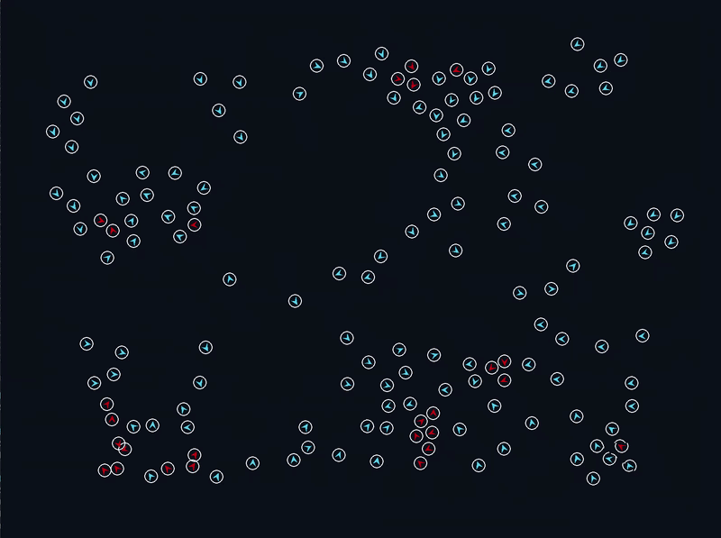

# 🐟 Boids — Simulation de Banc de Poissons

Ce projet est une simulation émergente du comportement d'un banc de poissons, développée avec **Python** et **Pygame**. Le programme implémente l'algorithme des "Boids", où des comportements globaux complexes (comme la formation d'un banc) émergent de règles locales simples appliquées à chaque individu.

---

## ⚙️ Principe de l'Algorithme

Le mouvement de chaque poisson est le résultat de la somme de quatre forces vectorielles. À chaque image, le poisson analyse son voisinage pour ajuster sa trajectoire.

### 1. 🛡️ La Séparation
Pour éviter que les poissons ne se chevauchent, une force de répulsion est appliquée. Si un voisin pénètre dans le **rayon de collision**, le poisson calcule un vecteur s'éloignant de celui-ci.
*   **Effet :** Maintient une distance minimale entre les individus.

### 2. 🔄 L'Alignement
Le poisson observe les poissons dans son rayon de perception et ajuste sa direction pour s'aligner sur la vitesse moyenne du groupe :

$$\vec{v}_{\mathrm{moyen}} = \frac{1}{N} \sum_{i=1}^{N} \vec{v}_{\mathrm{voisin}, i}$$
*   **Effet :** Crée un mouvement coordonné et fluide dans une même direction.

### 3. 🤝 La Cohésion
Le poisson est attiré par le "centre de masse" de ses voisins. Il calcule la position moyenne des individus proches et dirige son mouvement vers ce point.
*   **Effet :** Empêche les individus de s'éparpiller et force la formation de groupes compacts.

### 4. 🎯 L'Exploration
Chaque poisson possède une cible aléatoire dans l'espace. Une fois la cible atteinte (ou après un certain temps), une nouvelle destination est générée.
*   **Effet :** Apporte du dynamisme et évite que le banc ne reste statique ou ne tourne en cercle indéfiniment.

---

## 🛠️ Détails Techniques

### Gestion des Bordures
Pour maintenir les poissons à l'intérieur de la fenêtre, un système de **force de rappel** est utilisé. Lorsqu'un poisson approche des limites de l'écran, une force opposée est appliquée à son vecteur vitesse pour le rediriger vers le centre.

### Contrôle de la Vitesse
Pour garantir la stabilité visuelle, la norme du vecteur vitesse est bridée :
*   **Vitesse Max ($s_{max}$)** : Évite que les poissons ne "téléportent" à cause de forces trop cumulées.
*   **Vitesse Min ($s_{min}$)** : Garantit que les poissons restent toujours en mouvement.

### Représentation Visuelle
*   **Corps** : Un polygone dont l'angle est calculé via `atan2(vy, vx)`.
*   **Feedback visuel** : Les poissons virent au **rouge** lorsqu'une collision est détectée, illustrant l'activation de la force de séparation.

---

## 📈 Évolutions Possibles
- [ ] **Optimisation** : Cette version à du mal a formé un unique banc a partir de 300 individus
- [ ] **Prédateurs** : Ajouter une entité "prédateur" qui déclenche une force de fuite massive chez les boids.
- [ ] **Obstacles** : Ajouter des zones infranchissables pour tester la capacité d'évitement du groupe.
